# Deeter Analytics: Thursday-close research prototype

A small, reproducible price/volume screen translates the PM's “excitement, consolidation, then Friday continuation or stall” idea into frozen rules. It produces an interpretable Thursday list and a descriptive Friday event check. The lean is a heuristic, not a calibrated probability or a trading strategy. The separate portfolio-alert note is conceptual only.

The original assignment controls the deliverables. [RESEARCH_SPEC.md](RESEARCH_SPEC.md) records the frozen methodology. SEC EDGAR is an optional context extension for the current shortlist; it never affects qualification, ranks, scores, or historical outcomes.

## End-to-end flow

```mermaid
flowchart TD
    A["PM request<br/>Find stocks with excitement + volume,<br/>then a few consolidation days;<br/>prepare a Thursday-night continuation/stall read"]

    subgraph INPUTS["1 · Freeze the inputs"]
      B1["Current S&P 500 constituent-security snapshot<br/>Saved with source and retrieval timestamp<br/>May exceed 500 securities because some issuers have multiple share classes"]
      B2["Yahoo daily regular-session data<br/>Auto-adjusted Open / High / Low / Close<br/>Reported Volume + splits + dividends"]
      B3["SPY daily data<br/>Benchmark and common trading-session calendar<br/>Never included in stock ranks"]
      B4["Observation timestamp frozen before download<br/>A bar counts only after the scheduled NYSE close<br/>Prevents a partial Thursday/Friday bar becoming complete mid-run"]
      B1 --> B2
      B3 --> B4
      B2 --> B4
    end

    subgraph DATE["2 · Choose the decision Thursday t"]
      C1{"Requested --as-of date?"}
      C2["Use requested date only if it is<br/>a completed NYSE Thursday with a SPY bar"]
      C3["Otherwise use latest completed Thursday<br/>available in SPY"]
      C4["Label honestly:<br/>latest / pending Friday / Friday holiday / historical snapshot"]
      C1 -- yes --> C2 --> C4
      C1 -- no --> C3 --> C4
    end

    subgraph VALIDATE["3 · Build one leakage-safe 29-session stock window"]
      D1["Common SPY session positions<br/>t-28 ... t"]
      D2["Required stock OHLCV must exist for every position<br/>No forward fill · no shortened window"]
      D3{"Reject the stock-date if"}
      D4["Missing or non-finite OHLCV<br/>Nonpositive price or negative volume<br/>High/low envelope inconsistent<br/>Duplicate date<br/>Split anywhere in required window<br/>Nonpositive volume/range denominator"]
      D5["Valid stock enters the Thursday rank population"]
      D1 --> D2 --> D3
      D3 -- any invalid condition --> D4
      D3 -- valid --> D5
    end

    subgraph WINDOWS["4 · Partition the sessions — no overlap"]
      E1["Preceding close: t-28<br/>Needed for earliest historical range denominator"]
      E2["20-session baseline: t-27 ... t-8<br/>Strictly before the impulse"]
      E3["Impulse starting close: t-8"]
      E4["5 impulse sessions: t-7 ... t-3<br/>Five close-to-close intervals from C[t-8] to C[t-3]"]
      E5["3 consolidation sessions: t-2 ... t<br/>Ends at completed Thursday close"]
      E1 --> E2 --> E3 --> E4 --> E5
    end

    subgraph FEATURES["5 · Calculate Thursday-only features"]
      F1["Impulse return<br/>Stock: C[t-3] / C[t-8] - 1<br/>SPY: same endpoints<br/>Excess return = stock return - SPY return"]
      F2["Relative volume RVOL<br/>Mean Volume[t-7...t-3] ÷<br/>Median Volume[t-27...t-8]"]
      F3["Current 3-session range<br/>(max High[t-2...t] - min Low[t-2...t]) ÷ C[t-3]"]
      F4["Normal range<br/>Median of exactly 18 historical 3-session ranges<br/>inside t-27...t-8; each uses its own preceding close"]
      F5["Compression ratio<br/>current range ÷ normal range"]
      F6["Retention<br/>(C[t] - C[t-8]) ÷ (max High[t-7...t-3] - C[t-8])<br/>Clip to 0...1; nonpositive denominator is unscorable"]
      F7["Close location<br/>(C[t] - consolidation low) ÷ consolidation width<br/>Zero-width range receives neutral 0.5"]
      F8["Consolidation relative strength<br/>(stock C[t]/C[t-3]-1) - (SPY C[t]/C[t-3]-1)"]
      D5 --> F1 & F2 & F3 & F4 & F6 & F7 & F8
      F3 --> F5
      F4 --> F5
    end

    subgraph RANKS["6 · Rank before filtering"]
      G1["One shared valid-stock population for this Thursday<br/>SPY excluded"]
      G2["Average-tie percentile rank:<br/>excess return, RVOL, consolidation RS"]
      G3["Excitement score<br/>100 × mean(excess-return percentile, RVOL percentile)"]
      F1 & F2 & F5 & F8 --> G1 --> G2 --> G3
    end

    subgraph QUALIFY["7 · Apply the three strict setup rules"]
      H1{"Excess return > 0?"}
      H2{"RVOL > 1?"}
      H3{"Compression ratio < 1?"}
      H4["Does not qualify<br/>Still retained in full universe-features audit"]
      H5["Qualifying setup<br/>Negative absolute stock return is allowed<br/>when SPY fell more"]
      G3 --> H1
      H1 -- no --> H4
      H1 -- yes --> H2
      H2 -- no --> H4
      H2 -- yes --> H3
      H3 -- no --> H4
      H3 -- yes --> H5
    end

    subgraph LEAN["8 · Score direction without changing qualification"]
      I1{"Retention denominator valid?"}
      I2["Qualified but unscorable<br/>Kept in candidate audit with reason<br/>Not displayed to PM"]
      I3["Lean score<br/>100 × mean(retention, close location,<br/>consolidation-RS percentile)"]
      I4{"Unrounded lean score"}
      I5["> 50 → continuation lean"]
      I6["= 50 → balanced"]
      I7["< 50 → stall lean"]
      H5 --> I1
      I1 -- no --> I2
      I1 -- yes --> I3 --> I4
      I4 -- above 50 --> I5
      I4 -- exactly 50 --> I6
      I4 -- below 50 --> I7
    end

    subgraph OUTPUT["9 · Freeze the Thursday decision outputs"]
      J1["All qualified setups saved<br/>Unique decision_date + ticker<br/>Includes unscorable qualifiers and reasons"]
      J2["PM list: up to 10 scorable qualifiers<br/>Sort: excitement descending, ticker ascending"]
      J3["Current screen + eight-line PM note<br/>Raw inputs, scores, lean, one-line reason"]
      J4["September 24 saved run<br/>503 securities loaded<br/>minus APH split exclusion = 502 ranked<br/>65 qualified · 10 displayed · 55 remain in audit"]
      I2 & I5 & I6 & I7 --> J1
      J1 --> J2 --> J3 --> J4
    end

    subgraph FRIDAY["10 · Join outcomes only after Thursday decisions are persisted"]
      K1["Outcome date = immediate calendar Friday<br/>Monday is never substituted"]
      K2{"Friday status at frozen observation time"}
      K3["Holiday → holiday<br/>Excluded from completed statistics"]
      K4["Session not closed → pending<br/>Partial daily bar ignored"]
      K5["Completed but stock/SPY bar absent or invalid → missing_data"]
      K6{"Completed valid stock + SPY bars"}
      K7["Friday close > frozen consolidation high<br/>→ continuation"]
      K8["Otherwise Friday close ≤ Thursday close<br/>→ stall"]
      K9["Otherwise → neutral"]
      J1 --> K1 --> K2
      K2 -- market holiday --> K3
      K2 -- not yet closed --> K4
      K2 -- completed, data invalid --> K5
      K2 -- completed, valid --> K6
      K6 -- closing breakout --> K7
      K6 -- no breakout and unchanged/down --> K8
      K6 -- positive close inside range --> K9
    end

    subgraph EVIDENCE["11 · Aggregate descriptive evidence"]
      L1["Separate populations:<br/>all qualifiers vs each Thursday's PM top 10"]
      L2["Report n and denominator for<br/>continuation / neutral / stall rates"]
      L3["Report mean + median Friday stock return<br/>and excess return versus SPY"]
      L4["Frozen lean buckets:<br/>[0,20), [20,40), [40,60), [60,80), [80,100]"]
      L5["Count empty Thursdays, holidays, pending,<br/>missing, exclusions and unscorable cases"]
      K3 & K4 & K5 & K7 & K8 & K9 --> L1 --> L2 --> L3 --> L4 --> L5
    end

    subgraph CONTEXT["12 · Optional SEC context — outside the signal"]
      M1["Only the final current shortlist is eligible"]
      M2["Map ticker to CIK and verify issuer identity"]
      M3["Target forms: 8-K, 10-Q, 10-K, 6-K, 20-F<br/>including amendments"]
      M4["Use timezone-aware acceptance timestamps<br/>Impulse-start midnight ET through Thursday 20:00 ET,<br/>capped at the frozen data-observation time"]
      M5["Write separate context output<br/>SEC failure never changes Yahoo results"]
      J2 -. optional .-> M1 --> M2 --> M3 --> M4 --> M5
    end

    A --> INPUTS --> DATE --> VALIDATE --> WINDOWS
```



The key timing boundary is deliberate: every feature, rank, qualification decision, lean, and PM selection is calculated from data ending on Thursday. Friday data is read only by the separate outcome evaluator after the Thursday decision file has been written and hashed.

## Install and run

Python 3.11 or newer:

The repository has one launcher:

```sh
./run.sh setup       # once: create the environment and install dependencies
./run.sh fresh       # download current data and rebuild every output
./run.sh dashboard   # open the PM dashboard locally
./run.sh test        # run all deterministic correctness checks
```

Use `./run.sh replay` to reproduce the frozen cached data vintage without network requests. A fresh run creates the latest completed Thursday screen, scans approximately 12 months, saves decisions before joining Friday outcomes, writes both PM notes, and then adds optional current-shortlist SEC context. No credentials are required.

`--as-of` rejects non-Thursdays, holidays, unfinished sessions and missing SPY bars. `--months` may transparently shorten the evidence window; the submitted run uses 12. `--replay` requires the local `cache/`, sufficient warm-up, and preserves its original observation timestamp; enrichment uses only matching cached source responses and reports unavailable on cache misses. Run without it to obtain newer completed Fridays. Cache data are ignored by Git; the submitted empirical tables and constituent snapshot remain accessible without them. Fresh Yahoo downloads need not reproduce every value because the vendor revises history. The saved metadata records versions, data vintage, failures and a SHA-256 of the frozen decision CSV. Core data failures exit nonzero and write `RUN_FAILED.txt`; contextual failures are isolated as unavailable/insufficient and cannot invalidate the core. An unexpected context-report failure writes `ENRICHMENT_FAILED.txt`; inspect that marker before using older output files.

Tested on Python 3.11.4 with pandas 3.0.6, numpy 2.4.6, yfinance 1.7.0, requests 2.34.2, lxml 6.1.3 and pandas_market_calendars 5.4.0. Bounded dependencies are in `requirements.txt`; the exact installed environment is in `requirements-lock.txt`.

## Frozen definitions and choices

Let `t` be Thursday, and all offsets be **SPY trading sessions**, not calendar days. Use consistently adjusted OHLC and Yahoo's reported volume. Every feature is calculated from a slice ending at Thursday. See [RESEARCH_SPEC.md](RESEARCH_SPEC.md) for the full data contract, exclusions and exact equations.

| Rule | Executable definition and numerical justification |
| --- | --- |
| Impulse: 5 sessions | `t-7..t-3`; stock return `C[t-3]/C[t-8]-1` minus the same SPY return. Five represents one trading week. |
| Pause: 3 sessions | `t-2..t`; three makes “a few” explicit without choosing the length from Friday results. |
| Baseline: 20 sessions | `t-27..t-8`, roughly one trading month, strictly before impulse. Also require `C[t-28]`. |
| RVOL | Mean impulse volume / median baseline volume. Mean includes all impulse participation; median resists single historical spikes. |
| Range compression | Pause `(max(high)-min(low))/C[t-3]` divided by median of 18 comparable three-session ranges ending `t-25..t-8`, each divided by its preceding close. Twenty sessions contain 18 such windows. |
| Qualification | Excess return **>0**, RVOL **>1**, compression **<1**. Zero means SPY parity; one means the stock's own normal participation/range. Equality fails; thresholds are unfitted. |
| Excitement | `100*(excess-return percentile + RVOL percentile)/2`; equal weights avoid unsupported relative importance. |
| Retention | `(C[t]-C[t-8])/(impulse_high-C[t-8])`, clipped to `[0,1]`; the bounds represent none/all of the move. Nonpositive denominator is unscorable. |
| Close location | `(C[t]-pause_low)/(pause_high-pause_low)`; zero-width range gets midpoint **0.5**. |
| Pause RS | `C[t]/C[t-3]-1` minus SPY's same-window return, then its cross-sectional percentile. |
| Lean | `100*(retention+location+RS percentile)/3`; equal component weights. **>50** continuation, **<50** stall, **=50** balanced. Fifty is the midpoint, not an optimized boundary. |
| Display | Up to **10** qualifying, scorable names by excitement descending, ticker ascending for ties. Ten limits PM reading time. Preserve every qualifier in audit output. |
| Friday | Next calendar Friday only: close **>pause high** = continuation; else close **<=Thursday close** = stall; otherwise neutral. No buffer: a strict closing break is the definition. Record intraday breakout and continuous stock/SPY/excess returns too. |
| Evidence | **12 months** gives a recent-year descriptive check. Fixed lean bins `[0,20),[20,40),[40,60),[60,80),[80,100]` divide the scale into five equal intervals; 100 is included. |

All three percentiles use average-tie `pandas.rank(pct=True)` over the **same complete, setup-valid stock universe**, excluding SPY, **before** qualification and retention exclusions. Unscorable qualifiers remain in unconditional outcomes with a missing lean. A stock can qualify with negative absolute return if SPY fell more; the output flags this rather than adding a hidden filter. Retention and location are bounded raw values, while RS is a relative rank, so the lean is only partly cross-sectional. CSV precision governs every decision; Markdown rounds only for readability.

Alternate interpretations matter: excitement could mean news or options attention; consolidation could mean two sideways sessions or declining volume; “goes again” could mean an intraday break or any positive close. V1 instead measures relative price/volume, three-session range compression and a closing breakout. No earlier 8%, 1.5×, fixed 5% range, 40% retracement, ±2 score or 0.5% breakout rule is used.

## Actual dated run

Data observed **September 25, 2026 at 18:01:36 UTC / 14:01:36 America/New_York**. The current public snapshot contained **503 stock trading lines**; all 503 plus SPY downloaded successfully. The latest completed Thursday was **September 24, 2026**. Friday September 25 was still trading at the observation cutoff: its daily bars are **pending**, not evaluated. This is the latest Thursday-close snapshot for that pending Friday, not an intraday screen.

**502 valid stocks; 65 qualifiers; 10 displayed.** APH was excluded from the rank population because a split occurred in its required window. The full screen includes raw feature values, percentile ranks, scores and numerical explanations.

| Ticker | Excitement | Lean score | Lean |
| --- | ---: | ---: | --- |
| WBD | 97.31 | 83.50 | continuation |
| SWKS | 96.02 | 41.74 | stall |
| CIEN | 93.73 | 49.26 | stall |
| QCOM | 93.23 | 64.37 | continuation |
| AMD | 89.64 | 94.79 | continuation |
| DXCM | 86.06 | 37.10 | stall |
| COIN | 85.96 | 49.94 | stall |
| FFIV | 85.56 | 55.20 | continuation |
| CRWD | 84.36 | 91.44 | continuation |
| INTC | 84.16 | 98.80 | continuation |

For example, WBD retained 97% of its impulse and closed at 84% of its pause range; SWKS retained 67% but closed at only 8% of its range. These are price-derived reasons, not claims about a catalyst or institutional buying.

### Historical evidence: September 25, 2025–September 24, 2026

The scan considered **53 calendar Thursdays**, of which **50 were trading sessions**. Three Thursday holidays were omitted. Of the 50 screens, **46** had completed calendar Fridays, **3** had Friday holidays and **1** had a pending Friday. No Monday substitution occurred.

The median eligible universe was **499.5 stocks**. There were **2,718 qualifying name-events**, including **500 PM-visible top-10 cases**. **2,448** all-qualified observations and **460** top-10 observations had valid completed Friday outcomes. The remaining 205 qualifiers fell before Friday holidays and 65 were pending; no completed qualifying Friday observations were missing. Six qualifiers were unscorable across all screens, including three completed-Friday cases. There were 219 negative-absolute-impulse qualifiers. Pre-rank exclusions totaled 94 incomplete OHLCV name-dates and 100 split-window name-dates. These are repeated name/date exclusions, not 194 distinct companies.

| Completed-Friday population | n | Continuation | Neutral | Stall | Mean stock return | Mean excess vs SPY |
| --- | ---: | ---: | ---: | ---: | ---: | ---: |
| All qualifiers, including unscorable | 2,448 | 408 / 16.67% | 862 / 35.21% | 1,178 / 48.12% | −0.014% | +0.027% |
| PM-visible top 10 | 460 | 86 / 18.70% | 157 / 34.13% | 217 / 47.17% | −0.039% | −0.025% |

Among all qualifiers, higher leans had **309/1,221 (25.31%)** closing breakouts versus **99/1,224 (8.09%)** for lower leans. But mean excess returns were **+0.002% versus +0.052%**, respectively, and stall rates were similar (**47.75% versus 48.45%**). For the PM-visible list, higher/lower breakout rates were **70/273 (25.64%) versus 16/187 (8.56%)**; stall rates were **49.08% versus 44.39%**. Higher leans therefore did not consistently separate general favorable Friday performance.

A high Thursday close location mechanically leaves less distance to the breakout boundary, which can help explain breakout separation. The evidence does **not** establish forecasting skill or profitability. The [historical summary](outputs/historical_summary.md) reports exact denominators, mean/median returns, frozen buckets, exclusions and both populations. Sparse bins are underpowered; same-Friday names are correlated and not independent experiments.

## SEC context: optional, current shortlist only

The Yahoo core is complete before SEC is contacted. Its 5/3/20 windows, qualification, rank populations, scores, reasons and historical evaluation are unchanged. SEC writes a **separate keyed context table** for only the final up-to-ten displayed names; it is never passed into features, scoring or outcome evaluation. `--enrich-only` checks the frozen historical-decision hash and exact saved shortlist before making requests. Historical screens make no enrichment requests. The historical decision CSV never gains SEC columns.

**Cutoff:** Thursday **20:00 America/New_York**, capped at the saved Yahoo observation timestamp if run earlier. Every row records the cutoff, event-window start, coverage and source status. SEC is queried after the fact with bounded timestamps, so this is a reconstructed information set rather than an archived Thursday vintage.

**SEC:** map the ticker to a CIK, verify the identity against the official submissions response, and retain forms 8-K, 10-Q, 10-K, 6-K and 20-F (including amendments) accepted from impulse-start midnight Eastern through the cutoff. These forms provide corporate-disclosure context; ownership and other forms are outside this initial selection. Filter on `acceptanceDateTime`, reject missing/ambiguous time zones, and exclude filing dates after the cutoff's Eastern date to guard against next-day dissemination of late submissions. Save count, latest form/time/link and all matching records. A successful response with no matching target forms is `none`; errors are `unavailable`, with **null** count/flag rather than zero/false. This does not prove a catalyst or bullish/bearish news.

The SEC ticker map is attempted first. If unavailable, the same public constituent table's CIKs are used and verified against `data.sec.gov`; the warning and fallback provenance are saved. The default client declares `DeeterResearchPrototype/1.0`; `SEC_USER_AGENT` may supply a real administrative contact. Requests are sequential, paced below four per second, use bounded timeouts and at most one retry, and do not retry HTTP 403. API keys are unnecessary.

**Actual SEC run, September 25, 2026:** official submissions succeeded for all ten September 24 shortlist names. No selected target-form filings were accepted in their September 15–24 event windows, so each has a verified zero target-form count (`none`), not a failed-data zero. The SEC ticker-map endpoint returned HTTP 403; public-constituent CIKs were used and verified against each official submissions response. Raw response/request metadata live under `cache/context/<cutoff>/` and `outputs/context_metadata.json`. No historical SEC performance claim is made.

Direct timestamped news or social attention is intentionally outside the implemented scope. “Attention” is proxied by unusual stock-specific performance relative to SPY together with above-normal trading volume. This is a market-behavior proxy, not a direct measure of media or social interest.

## Outputs and small architecture

| Deliverable | Location |
| --- | --- |
| Readable screen and full-precision PM-visible rows | `outputs/current_thursday_screen.md`, `.csv` |
| All current qualifiers, including unscorable cases | `outputs/current_thursday_candidates_audit.csv` |
| Frozen historical candidate decisions, before outcomes | `outputs/historical_thursday_screens.csv` |
| Entire valid rank population on every Thursday | `outputs/universe_features.csv` |
| Separate Friday status/outcome records | `outputs/friday_outcomes.csv` |
| Historical evidence and machine-readable summaries | `outputs/historical_summary.md`, `outcome_summary.csv`, `lean_buckets.csv`, `lean_sanity.csv` |
| Optional SEC shortlist context and source audit | `outputs/current_screen_context.md`, `.csv`, `context_metadata.json` |
| Eight-line PM note | `outputs/pm_note_screen.md` |
| Separate half-page conceptual alert note | `outputs/pm_note_portfolio_alert.md` |
| Audit, data provenance and failures | `outputs/thursday_audit.csv`, `feature_exclusions.csv`, `run_metadata.json`, `universe_snapshot.csv` |
| Frozen constituent copy / locally cached inputs | `data/universe.csv` / `cache/` (ignored by Git) |

`main.py` only parses command-line options and handles failures. `src/pipeline.py` names each research step; `data.py`, `features.py`, `screen.py`, `evaluate.py`, `report.py`, and `enrichment.py` each own one concern. Research constants live in `config.py`. Tests use synthetic fixtures and never populate empirical outputs. The dashboard is a dependency-free static page under `dashboard/`.

The alert note proposes net **1%** position return and **0.25% NAV** aggregate qualifying gains for materiality, within **60 minutes** of entry. At least **three** distinct positions and **30%** of all open positions provide absolute and proportional breadth. It checks every **five minutes**, requires **two** consecutive qualifying checks, fires once and disarms. Rearming requires **two** consecutive nonqualifying checks **and 60 minutes** since the last alert, followed by two fresh qualifying checks. These are provisional noise/repetition controls, not researched thresholds. The note defines signed short returns, partial fills, costs, stale marks and the internal data needed; no portfolio results or alert code are fabricated.

## Verification and limitations

The suite covers exact windows and formulas, future-data mutations, truncation equivalence, rank populations, strict boundaries, deterministic ordering, missing/invalid data, Friday status and classification, SEC failure isolation, saved hashes, unique keys, and independent recomputation of historical summaries. Run `./run.sh test` for the current executed count.

The current S&P 500 snapshot projected backward introduces survivorship/selection bias, including additions before their real membership dates and omission of deletions. Yahoo adjusted history may be revised, delayed or affected by corporate actions; it is not an archived Thursday-night vintage or an institutional data feed. Windows containing reported splits are conservatively excluded; this cannot detect every vendor anomaly. Stock bars are never forward-filled. SPY dates are checked against the exchange calendar; missing benchmark sessions invalidate the screen instead of silently compressing time.

The exchange schedule gates completion at actual closes, including early closes. An observation cutoff frozen before downloading avoids treating partial bars as completed merely because the download or replay finishes later. The program identifies historical versus current snapshots and keeps pending, holiday and missing-data outcomes separate. A future run may change membership or revised data; saved CSVs and cache provenance identify the submitted vintage.

Daily public OHLCV does not measure news sentiment, live attention, true order flow, executions, borrow availability, costs, intraday paths, portfolio holdings or PM-specific catalysts. Fixed 5/3/20, top-10, midpoint and bin choices are defensible conventions, not economically validated cutoffs. Thresholds were frozen from the reviewed brief before looking at outcomes. This recent-regime descriptive check has no held-out validation and supports no trading-P&L inference. The next test is unchanged rules on prospectively frozen Thursday snapshots, with point-in-time constituents and corporate-action-consistent archived data.

Sources: [SEC submissions API](https://www.sec.gov/search-filings/edgar-application-programming-interfaces), [SEC fair access](https://www.sec.gov/search-filings/edgar-search-assistance/accessing-edgar-data), [public S&P 500 membership snapshot](https://en.wikipedia.org/wiki/List_of_S%26P_500_companies), [yfinance download documentation](https://ranaroussi.github.io/yfinance/reference/api/yfinance.download.html), [exchange-calendar schedules](https://pandas-market-calendars.readthedocs.io/en/latest/usage.html).

AI use: I used AI-assisted tools to accelerate implementation, testing, and documentation; I selected the methodology and reviewed the resulting definitions and outputs.
