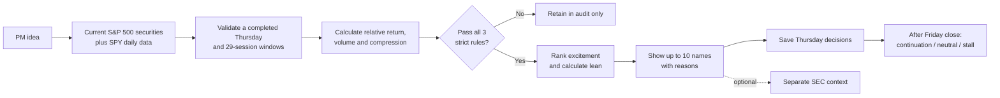

# Deeter Analytics: Thursday-close screen

A small, reproducible price/volume screen that turns the PM's "excitement, a few consolidation days, then Friday goes again or stalls" into fixed rules. It produces a Thursday-night list with a continuation/stall lean and a one-line reason for each name, a descriptive check of what happened on past Fridays, an eight-line PM note, and a half-page proposal for the portfolio alert.

The assignment is in [task.md](task.md). Exact formulas, data handling and the outcome protocol are in [RESEARCH_SPEC.md](RESEARCH_SPEC.md).

## From PM question to Friday evidence


```mermaid
flowchart LR
    A[PM idea] --> B[Current S&P 500 securities<br/>plus SPY daily data]
    B --> C[Validate a completed Thursday<br/>and 29-session windows]
    C --> D[Calculate relative return,<br/>volume and compression]
    D --> E{Pass all 3<br/>strict rules?}
    E -- No --> F[Retain in audit only]
    E -- Yes --> G[Rank excitement<br/>and calculate lean]
    G --> H[Show up to 10 names<br/>with reasons]
    H --> I[Save Thursday decisions]
    I --> J[After Friday close:<br/>continuation / neutral / stall]
    H -. optional .-> K[Separate SEC context]
```

The saved September run follows this funnel: **503 constituent securities loaded → 502 eligible and ranked → 65 qualified → 10 displayed**. See the [detailed calculation, timing and exclusion flow](docs/methodology-flow.md) for every window, formula, threshold and Friday branch.

## What the PM asked, and how it is operationalized

> Every week there are a few names everyone is excited about with volume, but then there are a few consolidation days. From there, either it goes again Friday, or it stalls. I want a list Thursday night…

All offsets are **trading sessions** ending at a completed Thursday close `t`, on the S&P 500 constituents, with SPY as the benchmark (SPY is never ranked).

| PM phrase | Executable rule | Number and why |
| --- | --- | --- |
| "excited about" | **Impulse**: stock return `C[t-3]/C[t-8]-1` minus SPY's return over the same sessions must be **> 0** | 5 sessions (`t-7..t-3`) = one trading week; 0 = SPY parity. Relative to SPY, so a stock can qualify on a down week if SPY fell more (flagged in outputs, not filtered) |
| "with volume" | **RVOL** = mean volume `t-7..t-3` ÷ median volume `t-27..t-8`, must be **> 1** | 20-session baseline ≈ one month, strictly before the impulse; 1 = the stock's own normal. Mean captures the whole impulse; median resists old spikes |
| "a few consolidation days" | **Compression** = 3-session range `t-2..t` ÷ median of 18 comparable 3-session ranges from the baseline, must be **< 1** | 3 sessions makes "a few" explicit; 1 = the stock's own normal range |
| "everyone" (ranking) | **Excitement** = 100 × mean(excess-return percentile, RVOL percentile), ranked across all eligible stocks **before** filtering; show the top **10** qualifiers | Equal weights avoid unsupported importance claims; 10 bounds reading time |
| "leaning" | **Lean** = 100 × mean(retention, close location, pause-relative-strength percentile). **> 50** continuation, **< 50** stall, **= 50** balanced | Retention: share of the impulse still held. Close location: where Thursday closed in the 3-day range. Pause RS: return vs SPY during the pause. 50 is the midpoint, not a fitted cutoff |
| "goes again" | Friday close **>** Thursday's 3-session high | A literal closing break of the consolidation range |
| "stalls" | Friday close **≤** Thursday close; anything in between is **neutral** | Distinguishes a flat/down Friday from a positive close inside the range |

All three qualification inequalities are strict. The lean is a heuristic summary of Thursday's price action, **not a probability**.

**Where the words could mean two things.** "Excited about" could mean news, social or options attention; here it is proxied by unusual performance relative to SPY plus above-normal volume, which is a market-behavior proxy, not a measure of media attention. "Consolidation" could mean sideways days or declining volume; here it is range compression. "Goes again" could mean an intraday break or any up close; here it is a closing breakout, with the intraday break recorded separately.

**RVOL > 1 is deliberately permissive.** It is an above-baseline participation gate, not an extreme-volume threshold. In broad high-volume weeks it filters little (on 24 September, quarterly-expiration volume on 18 September put most stocks above 1); the RVOL percentile inside the excitement score does most of the discrimination for the displayed names.

## Run it

Python 3.11+. No credentials.

```sh
./run.sh setup       # once: create .venv and install requirements.txt
./run.sh fresh       # download current data; screen the latest completed Thursday; rebuild all outputs
./run.sh dashboard   # serve outputs/dashboard.html locally
./run.sh test        # run the test suite
```

- `./run.sh fresh` always screens the **latest completed Thursday** at the time you run it, so a later run produces a later list. It overwrites `outputs/` and `cache/`. The committed `outputs/` are the record of the 24 September run.
- `.venv/bin/python main.py --as-of YYYY-MM-DD` screens a specific completed Thursday (non-Thursdays, holidays and unfinished sessions are rejected).
- `./run.sh replay` reruns a saved run offline from the local `cache/` written by a previous `fresh` run, into `outputs/replay/`. **`cache/` is not committed** (gitignored, about 5 MB), so a fresh clone cannot replay 24 September; run `fresh` first. Yahoo revises history, so a later fresh download need not reproduce every saved value.
- `main.py --render-only` rebuilds the PM note and dashboard from saved outputs without any download. `main.py --enrich-only` refreshes the optional SEC context without changing any signal.
- Tested on Python 3.11.4; the exact environment is in `requirements-lock.txt`.

## Weekly operating cycle

What the code does today:

1. **Thursday after the close:** `./run.sh fresh` refreshes the current constituent snapshot, downloads enough daily history, selects the latest completed Thursday, validates each required window, recomputes cross-sectional ranks, applies the fixed rules, selects up to ten names, saves the signal tables, adds optional SEC context, and renders the note and dashboard.
2. **Friday before the close:** the saved observation timestamp keeps Friday `pending`; a partial daily bar cannot become an outcome.
3. **Friday after the close:** another fresh run rebuilds the study and classifies the immediate Friday as continuation, neutral or stall. A Friday holiday is skipped; Monday is never substituted.
4. **Following week:** repeat. The target Thursday, universe, data window, eligible population, ranks, qualifiers, leans, SEC context and completed-Friday sample can change. The 5/3/20-session windows, three qualification thresholds, score formulas, top-10 limit and Friday label definitions remain fixed.

This is a repeatable research script, not an unattended service. A fresh run overwrites the current files rather than appending an immutable dated weekly archive, and Friday refresh currently recomputes the Thursday features from the same downloaded history instead of loading a separately locked Thursday artifact. Commit or copy each Thursday's `outputs/` before refreshing it if prospective records are required.

## Core versus optional context

- **Core:** Yahoo price/volume features, SPY-relative ranks, qualification, lean and Friday evidence.
- **Optional:** SEC EDGAR filings for the current displayed shortlist. SEC failures cannot change the core signal.
- **Future:** direct point-in-time news or social-attention data; neither is claimed or required now.

## Reading the screen

`outputs/current_thursday_screen.md` (readable) and `.csv` (full precision) have one row per displayed name. `outputs/dashboard.html` shows the same rows.

| Column | Meaning |
| --- | --- |
| `stock_impulse_return`, `spy_impulse_return`, `excess_return` | Five-session impulse returns (fractions) and their difference; `excess_return > 0` is rule 1 |
| `rvol` | Impulse volume vs baseline (ratio); `> 1` is rule 2 |
| `compression_ratio` | Pause range vs normal range (ratio); `< 1` is rule 3 |
| `excess_return_percentile`, `rvol_percentile`, `excitement_score` | Cross-sectional ranks and their average (0–100); sets the display order |
| `retention`, `close_location`, `consolidation_rs_percentile` | The three lean inputs, each 0–1 |
| `lean_score`, `lean` | 0–100 score and its label; distance from 50 is the strength, so 49 or 51 is near neutral |
| `reason` | One line built from the numbers above |

## Saved run: Thursday 24 September 2026

Data observed 25 September 2026, 14:01 America/New_York, while Friday was still trading, so Friday outcomes are **pending**.

**503** S&P 500 constituent securities loaded (more than 500 because some issuers have several share classes) − **APH**, excluded because a stock split fell inside its required window = **502** eligible and ranked → **65** passed all three rules → **10** displayed. The other 55 qualifiers are in `outputs/current_thursday_candidates_audit.csv`.

| Ticker | Excitement | Lean score | Lean |
| --- | ---: | ---: | --- |
| WBD | 97.31 | 83.50 | continuation |
| SWKS | 96.02 | 41.74 | stall |
| CIEN | 93.73 | 49.26 | stall (near neutral) |
| QCOM | 93.23 | 64.37 | continuation |
| AMD | 89.64 | 94.79 | continuation |
| DXCM | 86.06 | 37.10 | stall |
| COIN | 85.96 | 49.94 | stall (near neutral) |
| FFIV | 85.56 | 55.20 | continuation |
| CRWD | 84.36 | 91.44 | continuation |
| INTC | 84.16 | 98.80 | continuation |

Seven of the ten are Information Technology, so the list is closer to one sector theme than ten independent ideas. The PM note is `outputs/pm_note_screen.md`.

## Evidence: what happened on Fridays

The same fixed rules were rerun on every Thursday from 25 September 2025 to 24 September 2026: 53 calendar Thursdays, 50 trading sessions, **46 with a completed Friday** (3 Friday holidays skipped, never replaced by Monday; 1 pending).

| Completed-Friday population | n | Continuation | Neutral | Stall | Mean return vs SPY |
| --- | ---: | ---: | ---: | ---: | ---: |
| All qualifiers | 2,448 | 16.7% | 35.2% | 48.1% | +0.03% |
| Displayed top 10 each week | 460 | 18.7% | 34.1% | 47.2% | −0.03% |

- Higher leans closed above the range far more often than lower leans (all qualifiers 25.3% vs 8.1%; top 10 25.6% vs 8.6%), but **stall rates were similar** (47.8% vs 48.4%; top 10 49.1% vs 44.4%) and there is **no demonstrated return edge**.
- Part of the breakout gap is mechanical: a Thursday close near the top of the range is already close to the breakout line.
- Names on the same Friday are correlated, so 460 name-events are closer to 46 weekly observations. No significance is claimed, and no costs, sizing or P&L are modelled.

Details, exact denominators, lean buckets and exclusions are in `outputs/historical_summary.md`.

**Traps, named.**

- *Look-ahead:* every feature and rank uses data up to Thursday only. A bar counts only after its scheduled NYSE close relative to a timestamp frozen before download. Friday data is joined in a separate step after the Thursday decisions are written. Tests mutate or delete all post-Thursday data and check that nothing changes.
- *Survivorship:* today's S&P 500 membership is projected backward, which drops deletions and includes additions before they joined.
- *Thresholds fitted to the answer:* the thresholds are fixed constants in `config.py`, applied unchanged to every Thursday, and the code performs no parameter search. The repository history cannot prove when they were chosen, so treat the evidence as descriptive, not as out-of-sample validation.

**What free data cannot test, and how to test it with the right data.** Daily Yahoo bars cannot show news or social attention, options activity, true order flow, the intraday path on Friday, or the data exactly as it looked on Thursday night. With point-in-time index membership, archived as-of-Thursday bars, timestamped news or social volume, options volume, and intraday Friday bars, the same rules could be re-tested without survivorship, with direct attention measures, and with a tradable Friday entry. The cheapest next step is prospective: save each Thursday's list before Friday and evaluate unchanged rules on those held-out Fridays. A comparison against non-qualifying stocks on the same Fridays would also be a natural extension.

## Optional SEC context

After the Yahoo screen is complete, the ten displayed names get a separate SEC EDGAR lookup: target forms (8-K, 10-Q, 10-K, 6-K, 20-F and amendments) accepted between impulse start and Thursday 20:00 New York time, capped at the data observation time. It answers "did a filing coincide with this move?" and **never** affects qualification, ranks, lean or Friday labels. If SEC fails, the screen still completes and the context is marked `unavailable` (which does not mean "no filings"). For 24 September all ten names returned `none`. Historical Thursdays are not enriched. Outputs: `outputs/current_screen_context.{md,csv}`, `outputs/context_metadata.json`.

**Not included:** direct news or social-media attention. It is future work, not a runtime dependency.

## Portfolio alert

`outputs/pm_note_portfolio_alert.md` is a half-page, no-code proposal for "doing well quickly on many positions". It defines doing well (at least 1% net gain per position, qualifying gains at least 0.25% of NAV), quickly (within 60 minutes of entry), many (at least 3 positions and at least 30% of open positions), a five-minute check cadence, and anti-noise rules (two consecutive confirmations, fire once, rearm only after two non-qualifying checks and 60 minutes). It is conceptual and untested; validating it needs internal positions and marks.

## Outputs

| File | Contents |
| --- | --- |
| `current_thursday_screen.{md,csv}` | Displayed list with every rule input, lean and reason |
| `current_thursday_candidates_audit.csv` | All qualifiers for the screened Thursday |
| `pm_note_screen.md` | Eight-line PM note (generated from saved outputs) |
| `pm_note_portfolio_alert.md` | Half-page alert proposal |
| `dashboard.html` | Static view of the saved outputs |
| `historical_summary.md`, `outcome_summary.csv`, `lean_buckets.csv`, `lean_sanity.csv` | Friday evidence |
| `historical_thursday_screens.csv`, `friday_outcomes.csv` | Every historical qualifier, and its Friday outcome kept in a separate file |
| `universe_features.csv` | The full ranked population on every Thursday (proves pre-filter ranking) |
| `thursday_audit.csv`, `feature_exclusions.csv`, `run_metadata.json`, `universe_snapshot.csv` | Per-Thursday status, exclusions, data provenance and the exact constituent list |
| `current_screen_context.{md,csv}`, `context_metadata.json` | Optional SEC context |

Code: `main.py` (command line), `src/pipeline.py` (steps in order), `data.py`, `features.py`, `screen.py`, `evaluate.py`, `report.py`, `dashboard.py`, `enrichment.py`; constants in `config.py`. Tests in `tests/` use synthetic fixtures plus checks on the saved outputs.

## Limitations

Current membership projected backward (survivorship bias); Yahoo adjusted data downloaded after the fact rather than an archived Thursday-night vintage; windows containing a reported split are excluded, which cannot catch every vendor error; no news, sentiment, options, order flow, intraday path, costs, borrow or portfolio data; fixed 5/3/20, top-10 and midpoint choices are defensible conventions, not validated optima; one year of correlated weekly observations supports description, not a trading claim.

AI use: I used AI-assisted tools to accelerate implementation, testing, and documentation; I selected the methodology and reviewed the resulting definitions and outputs.
