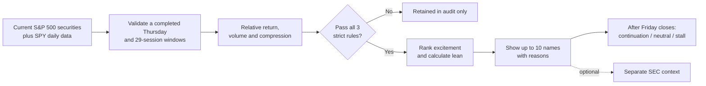

# Deeter Analytics: Thursday-close screen

A small, reproducible price/volume screen that turns the PM's "excitement, a few consolidation days, then Friday goes again or stalls" into fixed rules. It produces a Thursday-night list with a continuation/stall lean and a one-line reason for each name, a descriptive check of what happened on past Fridays, an eight-line PM note, and a half-page proposal for the portfolio alert.

The assignment is in [task.md](task.md). Exact formulas, data handling and the outcome protocol are in [RESEARCH_SPEC.md](RESEARCH_SPEC.md); this README is the operating guide.

**Scope.** The core screen, its definitions and the historical Friday check were built to the take-home scope. With the extension, I used the extra time for optional SEC context, reproducibility hardening (frozen fixture, clock-independent replay, dated archives), testing and presentation. SEC enrichment is context only and never affects qualification, excitement, lean or Friday labels.

## Quick start

Requires Python 3.11+ and `bash`. No credentials.

```sh
./run.sh setup     # create .venv and install the locked versions in requirements-lock.txt (network: PyPI)
./run.sh test      # fast correctness suite, offline, about 15 seconds
./run.sh replay    # reproduce the submitted 24 September screen offline, about 2 minutes
```

Then, to screen the latest completed Thursday with current public data:

```sh
./run.sh fresh     # network: Wikipedia, Yahoo Finance, SEC EDGAR; about 2–3 minutes
```

## What to open

```text
outputs/
├── deliverables/   human-readable submission artifacts: start here
├── data/           machine-readable evidence the deliverables are built from
└── runs/           immutable dated snapshots; runs/2026-09-24/ is the submission
```

**Start here:** open `outputs/deliverables/dashboard.html` directly in any browser. It is one self-contained file (inline styles, data embedded, no scripts or network requests), so no server is needed. Hover over, or tab to, any label marked ⓘ for a short definition. `./run.sh dashboard` is only an optional convenience that serves the same file at `http://127.0.0.1:8765/dashboard.html` (port set by `DASHBOARD_PORT`).

The other files in `outputs/deliverables/`:

- `current_thursday_screen.md`: the Thursday list with the numbers behind each rule, the lean and a plain-English reason.
- `pm_note_screen.md`: the eight-line note to the PM.
- `pm_note_portfolio_alert.md`: the half-page portfolio-alert proposal.
- `historical_summary.md`: what happened on past Fridays, with every denominator.

`outputs/data/` is not clutter: it holds the machine-readable files the deliverables are generated from, so any claim can be traced by hand. It keeps all qualifiers (not just the ten shown), the full ranked population with every feature value, pre-ranking exclusions such as APH's split, every historical candidate event and its Friday outcome, run metadata (observation time, decision hash) and the optional SEC context. See [Supporting data](#supporting-data) for the file list.

`outputs/runs/2026-09-24/` preserves the submitted run exactly as it was saved, in the same `deliverables/` and `data/` layout, and is never overwritten. `./run.sh replay` writes the same layout to `outputs/replay/`, which Git ignores.

## Command reference

| Action | Command | Data / network | Writes to | Effect on saved results |
| --- | --- | --- | --- | --- |
| Install | `./run.sh setup` | PyPI; exact versions from `requirements-lock.txt` | `.venv/` | None |
| Fast tests | `./run.sh test` | Offline; committed outputs and synthetic fixtures | Temporary folders only | None. The slow integration test is skipped here |
| Frozen end-to-end test | `./run.sh integration` | Offline; committed fixture | Temporary folder | None. Checks the 503 → 502 → 65 → 10 funnel, ticker order and decision hash |
| Reproduce the submission | `./run.sh replay` | Offline; always `fixtures/frozen_2026-09-24/` | `outputs/replay/` (ignored by Git) | None: `outputs/deliverables/`, `outputs/data/` and the dated archive are untouched |
| Current screen | `./run.sh fresh` | Live Wikipedia constituents, Yahoo daily bars, SEC if the Friday is still pending | `outputs/deliverables/`, `outputs/data/`, `outputs/runs/<Thursday>/`, `cache/` | Replaces `outputs/deliverables/` and `outputs/data/`; adds a dated archive, but never overwrites an existing one |
| Serve the dashboard (optional) | `./run.sh dashboard` | Local only | Nothing | None |

Advanced `main.py` options, run as `.venv/bin/python main.py …`:

- `--as-of YYYY-MM-DD` screens a specific completed Thursday with live data (non-Thursdays, holidays and unfinished sessions are rejected). Writes like `fresh`.
- `--render-only` rebuilds the PM notes and dashboard from the saved files in `--output-dir` (default `outputs/`) without any download.
- `--enrich-only` refreshes only the optional SEC context for the saved screen; it never changes a signal.

`setup` installs the exact package versions in `requirements-lock.txt`, recorded on Python 3.11.4 and verified to install on Python 3.13. `requirements.txt` lists only the direct dependencies with version ranges, for other environments; different package versions can change the last floating-point digit of some summary CSVs.

## Replay versus fresh

**`./run.sh replay`** reproduces the submitted point-in-time snapshot.

- It always reads the committed input vintage in `fixtures/frozen_2026-09-24/`, whatever a previous `fresh` run left in `cache/`.
- It uses the fixture's recorded observation time (25 September 2026, 14:01 New York) for every date window, the decision Thursday and every completeness check, never your computer's clock, so it gives the same result months later. Friday 25 September had not closed at that time, so that week's Friday outcome is `pending` (see below).
- With the locked environment it is deterministic: the screen, candidate audit, rank population, historical decisions and Friday outcomes are byte-identical to the committed outputs, with the same decision hash, and so are the PM notes, screen and historical summary. The dashboard matches too, except that from a clean clone its SEC column reads `unavailable`, because SEC responses are not committed. The three summary tables (`outcome_summary.csv`, `lean_buckets.csv`, `lean_sanity.csv`) agree to about 1e-16, because the committed ones were computed from the live download before it was saved as the fixture; `run_metadata.json` and the SEC files also record when the replay ran.
- The optional SEC response cache is not committed, so replay marks SEC context `unavailable` rather than inventing a "no filing" result.

**`./run.sh fresh`** runs the screen on today's public data.

- It fetches the current S&P 500 constituent list, downloads Yahoo daily bars, and screens the latest Thursday whose close has completed.
- It rewrites `outputs/deliverables/` and `outputs/data/` and rebuilds the 12-month event study with the same fixed rules.
- Numbers can differ slightly from the frozen snapshot even for the same Thursday, because Yahoo revises adjusted history.
- **Dated archive:** each run also saves `outputs/runs/<Thursday>/`. An existing dated folder is never overwritten. If a later run of the same Thursday produces different numbers, the frozen folder is kept, a `NOTE: existing archived decision … preserved` message is printed, `archive_status` is recorded in `outputs/data/run_metadata.json`, and the run still succeeds. This is why `outputs/runs/2026-09-24/` exists alongside `outputs/deliverables/` and `outputs/data/`: those show the latest run, the dated folder keeps the submitted one.

Weekly use: run `fresh` after the Thursday close. Until Friday closes, that Friday stays `pending`. Any later run labels the completed Friday with the same rules. This is a repeatable research script, not a production service or a live Friday monitor.

## What the PM asked, and how it is operationalized

> Every week there are a few names everyone is excited about with volume, but then there are a few consolidation days. From there, either it goes again Friday, or it stalls. I want a list Thursday night…


```mermaid
flowchart LR
    A[Current S&P 500 securities<br/>plus SPY daily data] --> B[Validate a completed Thursday<br/>and 29-session windows]
    B --> C[Relative return,<br/>volume and compression]
    C --> D{Pass all 3<br/>strict rules?}
    D -- No --> E[Retained in audit only]
    D -- Yes --> F[Rank excitement<br/>and calculate lean]
    F --> G[Show up to 10 names<br/>with reasons]
    G --> H[After Friday closes:<br/>continuation / neutral / stall]
    G -. optional .-> I[Separate SEC context]
```

See the [detailed calculation, timing and exclusion flow](docs/methodology-flow.md) for every branch. All offsets are **trading sessions** ending at a completed Thursday close `t`, on the S&P 500 constituents, with SPY as the benchmark (SPY is never ranked).

| PM phrase | Executable rule | Number and why |
| --- | --- | --- |
| "excited about" | **Impulse**: stock return `C[t-3]/C[t-8]-1` minus SPY's return over the same sessions must be **> 0** | 5 sessions (`t-7..t-3`) = one trading week; 0 = SPY parity. Relative to SPY, so a stock can qualify on a down week if SPY fell more (flagged in outputs, not filtered) |
| "with volume" | **RVOL** = mean volume `t-7..t-3` ÷ median volume `t-27..t-8`, must be **> 1** | 20-session baseline ≈ one month, strictly before the impulse; 1 = the stock's own normal. Mean captures the whole impulse; median resists old spikes |
| "a few consolidation days" | **Compression** = 3-session range `t-2..t` ÷ median of 18 comparable 3-session ranges from the baseline, must be **< 1** | 3 sessions makes "a few" explicit; 1 = the stock's own normal range |
| "everyone" (ranking) | **Excitement** = 100 × mean(excess-return percentile, RVOL percentile), ranked across all eligible securities **before** filtering; show the top **10** qualifiers | Equal weights avoid unsupported importance claims; 10 bounds reading time |
| "leaning" | **Lean** = 100 × mean(retention, close location, pause-relative-strength percentile). **> 50** continuation, **< 50** stall, **= 50** balanced | Retention: share of the impulse still held. Close location: where Thursday closed in the 3-day range. Pause RS: return vs SPY during the pause. 50 is the midpoint, not a fitted cutoff |
| "goes again" | Friday close **>** Thursday's 3-session high | A literal closing break of the consolidation range |
| "stalls" | Friday close **≤** Thursday close; anything in between is **neutral** | Distinguishes a flat/down Friday from a positive close inside the range |

All three qualification inequalities are strict. The lean is a heuristic summary of Thursday's price action, **not a probability**.

**Where the words could mean two things.** "Excited about" could mean news, social or options attention; here it is proxied by unusual performance relative to SPY plus above-normal volume, which is a market-behavior proxy, not a measure of media attention. "Consolidation" could mean sideways days or declining volume; here it is three-session range compression. It does not require "no new high", so a failed new high still qualifies if the whole three-session range is tighter than the stock's normal range. "Goes again" could mean an intraday break or any up close; here it is a closing breakout, with the intraday break recorded separately.

**RVOL > 1 is deliberately permissive.** It is an above-baseline participation gate, not an extreme-volume threshold, and broad high-volume weeks make it weakly binding: for 24 September, 481 of 502 eligible constituent securities were above 1 (the impulse window included the 18 September quarterly expiration). The RVOL percentile inside the excitement score does the stronger discrimination for the displayed names.

## Friday outcomes and statuses

A Friday is labelled only after that Friday's session has fully closed, using completed daily bars:

- **continuation**: Friday close > Thursday's three-session consolidation high.
- **stall**: otherwise, Friday close ≤ Thursday close.
- **neutral**: every other completed case (a positive close still inside the range).

Each name's Friday also has a status (`status` in `outputs/data/friday_outcomes.csv`; `outputs/data/thursday_audit.csv` records the per-Thursday `friday_status`, which is one of the first three):

| Status | Meaning | In the evidence? |
| --- | --- | --- |
| `completed` | Friday closed before the run's observation time and valid stock and SPY bars exist | Yes; receives a label |
| `pending` | Friday had not closed at the run's observation time | No. Not a failed signal and not missing data |
| `holiday` | No Friday session; Monday is never substituted | No |
| `missing_data` | Friday closed, but a valid stock or SPY bar is absent, invalid or has a split | No |

The observation time is frozen before any download, and a bar only counts once its scheduled NYSE close has passed. The frozen replay therefore preserves the information state at the saved observation time: its Friday is `pending` and stays out of every completed-Friday rate. That is point-in-time integrity, not missing data. All historical rates use completed valid Fridays only.

## Reading the dashboard and screen

`outputs/deliverables/dashboard.html` is generated from the files in `outputs/data/` every time the pipeline runs; it holds no numbers of its own. Its ⓘ notes define Excitement, Impulse vs SPY, RVOL, Compression, Lean and its inputs, SEC context, the Friday status and the Friday labels; exact formulas are in the definitions table above and in [RESEARCH_SPEC.md](RESEARCH_SPEC.md).

1. **Funnel:** constituent securities loaded → eligible and ranked → passed all three rules → shown, plus pre-ranking exclusions.
2. **Data-quality status:** latest completed bar, failed downloads, exclusions, and the immediate Friday status with a sentence explaining it.
3. **Excitement:** the ranking score (0–100) that orders the list.
4. **Qualification numbers:** impulse vs SPY, RVOL and compression for each name.
5. **Lean and its inputs:** retention, close location and pause relative-strength percentile. Scores close to 50 carry little direction.
6. **Evidence and SEC context:** past-Friday rates for higher vs lower leans, and the optional filing check.

`outputs/deliverables/current_thursday_screen.md` shows the list with the numbers behind each rule, the lean score and a plain-English reason. `outputs/data/current_thursday_screen.csv` has the same rows at full precision with every field:

| Column | Meaning |
| --- | --- |
| `stock_impulse_return`, `spy_impulse_return`, `excess_return` | Five-session impulse returns (fractions) and their difference; `excess_return > 0` is rule 1 |
| `rvol` | Impulse volume vs baseline (ratio); `> 1` is rule 2 |
| `compression_ratio` | Pause range vs normal range (ratio); `< 1` is rule 3 |
| `excess_return_percentile`, `rvol_percentile`, `excitement_score` | Cross-sectional ranks and their average (0–100); sets the display order |
| `retention`, `close_location`, `consolidation_rs_percentile` | The three lean inputs, each 0–1 |
| `lean_score`, `lean` | 0–100 score and its label; distance from 50 is the strength, so 49 or 51 is near neutral |
| `reason` | A numeric audit line built from the numbers above; the deliverables show a plain-English version of the same values |

## Submitted snapshot: Thursday 24 September 2026

This section describes the frozen, committed run. Data observed 25 September 2026, 14:01 America/New_York, while Friday was still trading, so its Friday outcomes are **pending**.

**503** S&P 500 constituent securities loaded (more than 500 because some issuers have several share classes) − **APH**, excluded because a stock split fell inside its required window = **502** eligible and ranked → **65** passed all three rules → **10** displayed. The other 55 qualifiers are in `outputs/data/current_thursday_candidates_audit.csv`.

| Ticker | Excitement | Lean score | Lean |
| --- | ---: | ---: | --- |
| WBD | 97.31 | 83.50 | continuation |
| SWKS | 96.02 | 41.74 | stall |
| CIEN | 93.73 | 49.26 | stall (near neutral) |
| QCOM | 93.23 | 64.37 | continuation |
| AMD | 89.64 | 94.79 | continuation |
| DXCM | 86.06 | 37.10 | stall |
| COIN | 85.96 | 49.94 | stall (near neutral) |
| FFIV | 85.56 | 55.20 | continuation |
| CRWD | 84.36 | 91.44 | continuation |
| INTC | 84.16 | 98.80 | continuation |

Seven of the ten are Information Technology, so the list is closer to one sector theme than ten independent ideas. The PM note is `outputs/deliverables/pm_note_screen.md`.

## Evidence: what happened on Fridays

The same fixed rules were rerun on every Thursday from 25 September 2025 to 24 September 2026: 53 calendar Thursdays, 50 trading sessions, **46 with a completed Friday** (3 Friday holidays, 1 pending).

| Completed-Friday population | n | Continuation | Neutral | Stall | Mean return vs SPY |
| --- | ---: | ---: | ---: | ---: | ---: |
| All qualifiers | 2,448 | 16.7% | 35.2% | 48.1% | +0.03% |
| Displayed top 10 each week | 460 | 18.7% | 34.1% | 47.2% | −0.03% |

- Higher leans closed above the range far more often than lower leans (all qualifiers 25.3% vs 8.1%; top 10 25.6% vs 8.6%), but they **did not stall less** (all qualifiers 47.8% vs 48.4%; top 10 49.1% vs 44.4%), and this sample shows **no return edge**.
- Part of the breakout gap is mechanical: a Thursday close near the top of the range is already close to the breakout line.
- The 2,448 completed candidate events are clustered across only 46 completed Fridays, and names on the same Friday are correlated, so they should not be read as thousands of independent observations. No significance is claimed, and no costs, sizing or P&L are modelled.

Exact denominators, lean buckets and exclusions are in `outputs/deliverables/historical_summary.md`.

**Traps, named.**

- *Look-ahead:* every feature and rank uses data up to Thursday only. A bar counts only after its scheduled NYSE close relative to a timestamp frozen before download. Friday data is joined in a separate step after the Thursday decisions are written. Tests mutate or delete all post-Thursday data and check that nothing changes.
- *Survivorship:* today's S&P 500 membership is projected backward, which drops deletions and includes additions before they joined.
- *Thresholds fitted to the answer:* the thresholds are fixed constants in `config.py`, applied unchanged to every Thursday, and the code performs no parameter search; the values are unchanged since the screen's first commit. That history cannot prove when they were chosen, so treat the evidence as descriptive, not as out-of-sample validation.

**What free data cannot test, and how to test it with the right data.** Daily Yahoo bars cannot show news or social attention, options activity, true order flow, the intraday path on Friday, or the data exactly as it looked on Thursday night. With point-in-time index membership, archived as-of-Thursday bars, timestamped news or social volume, options volume, and intraday Friday bars, the same rules could be re-tested without survivorship, with direct attention measures, and with a tradable Friday entry. The cheapest next step is prospective and fixed in advance: on the next 10 saved Thursday lists, compare leans above vs below 50 Friday by Friday on breakout rate, stall rate and mean return vs SPY, and keep investigating only if the breakout gap persists and higher leans also stall less and beat SPY on most of those Fridays.

## Optional SEC context

After the Yahoo screen is complete, the displayed names get a separate SEC EDGAR lookup: target forms (8-K, 10-Q, 10-K, 6-K, 20-F and amendments) accepted between impulse start and Thursday 20:00 New York time, capped at the data observation time. It answers "did a filing coincide with this move?" and **never** affects qualification, excitement, lean or Friday labels. If SEC fails, the screen still completes. It was added with extension time, after the core screen.

| `sec_status` | Meaning |
| --- | --- |
| `ok` | Query succeeded; target filings were found (count, latest form and link shown) |
| `none` | Query succeeded; no target filing in the window |
| `unavailable` | Query failed or no cached response; this does **not** mean "no filing" |
| `not_requested_historical` | Snapshot whose Friday had already closed, or a historical Thursday; no request is made |

For 24 September all ten names returned `none` in the live run; `replay` shows `unavailable` because SEC responses are not committed. For more reliable live SEC context, set `SEC_USER_AGENT="Name email@example.com"`; if SEC rejects or throttles the request, the context is marked `unavailable` and the core screen is unaffected.

**Not included:** direct news or social-media attention. It is future work, not a runtime dependency.

## Portfolio alert

`outputs/deliverables/pm_note_portfolio_alert.md` is a half-page, no-code proposal for "doing well quickly on many positions". It defines doing well (at least 1% net gain per position, qualifying gains at least 0.25% of NAV), quickly (within 60 minutes of entry; the note explains the alternative "recent acceleration of the existing book" reading), many (at least 3 positions and at least 30% of open positions), a five-minute check cadence, and anti-noise rules (two consecutive confirmations, fire once, rearm only after two non-qualifying checks and 60 minutes). It is conceptual and untested; validating it needs internal positions and marks.

## Supporting data

Files in `outputs/data/`. The dashboard and notes are built from them; none is needed just to read the deliverables.

| File | What it is for |
| --- | --- |
| `current_thursday_screen.csv` | The displayed list at full precision |
| `current_thursday_candidates_audit.csv` | Every qualifier for that Thursday, not just the ten shown |
| `universe_features.csv` | The full ranked population on every Thursday (shows ranking happens before filtering) |
| `historical_thursday_screens.csv`, `friday_outcomes.csv` | Every historical qualifier, and its Friday status and label, kept in separate files |
| `outcome_summary.csv`, `lean_buckets.csv`, `lean_sanity.csv` | The evidence tables behind the summary, note and dashboard |
| `thursday_audit.csv`, `feature_exclusions.csv` | Per-Thursday status and every pre-ranking exclusion with its reason |
| `run_metadata.json`, `universe_snapshot.csv` | Data provenance, observation time, decision hash, archive status and the exact constituent list |
| `current_screen_context.{md,csv}`, `context_metadata.json` | Optional SEC context and request provenance |

`outputs/runs/2026-09-24/data/` holds the same files as saved by the submitted run, except `universe_features.csv`, which that run kept only in the latest-run folder.

A failed core run writes `outputs/RUN_FAILED.txt`; a failed SEC step writes `outputs/ENRICHMENT_FAILED.txt` and leaves the core results valid.

Code: `main.py` (command line), `src/pipeline.py` (steps in order), `data.py`, `features.py`, `screen.py`, `evaluate.py`, `report.py`, `dashboard.py`, `enrichment.py`; constants in `config.py`. Tests in `tests/` use synthetic fixtures, an independent numpy oracle for the frozen 24 September screen, and checks on the saved outputs.

## Limitations, design choices, and next tests

These are deliberate scope choices or known limits of free daily data. None was tuned after seeing Friday outcomes: every value in `config.py` is unchanged since the screen's first commit (`git log -p config.py`), though that history cannot prove the values were chosen before any outcome was seen.

| Choice or limitation | What it means here | What a longer project would test |
| --- | --- | --- |
| Upside reading of a long/short book | "Excited" and "goes again" are read as an upside setup. A `stall` lean is not a short signal. | A mirror short-side screen: unusually weak relative performance on elevated volume, a pause after the selloff, and downside continuation labels. |
| RVOL > 1 is a permissive floor | It filters little in broad high-volume weeks (481 of 502 on 24 September); the RVOL percentile inside excitement does most of the differentiation. | Pre-registered alternative participation floors or volume-rank cutoffs, fixed before looking at outcomes. |
| Relative entry can include absolute losers | The impulse gate is SPY-relative, so a stock that fell less than SPY qualifies. This is intentional under the market-relative reading. | Adding a positive-absolute-return requirement if the PM means absolute upside only. |
| Relative entry, absolute Friday labels | Entry is measured against SPY, but continuation and stall use the stock's own chart ("goes again" / "stalls"), so a broad market move on Friday can drive the label. | Report absolute, SPY-relative and same-Friday base-rate outcomes side by side. |
| `stall` mixes several outcomes | Any Friday close at or below Thursday's close counts, so failed continuation, mild weakness and a true breakdown share one label. | Split stall into flat, soft and range-breakdown states. |
| 50 as the lean midpoint | Each input has a natural middle: about half the move kept, a close mid-range, median relative strength among peers. Their equal-weight average therefore uses 50 as a transparent midpoint. It is not a calibrated probability. | Calibrate the lean against outcomes on data it was not built on. |
| Dependent observations | 2,448 completed name-events fall on only 46 Fridays, and names on one Friday move together, so they are not thousands of independent experiments. Results are descriptive. | Summarize by Friday, and use date-level or block-bootstrap inference if significance is needed. |
| No non-qualifier or market base rate | Outcomes are compared within qualifiers and across lean groups only. The study does not show whether qualifiers beat non-qualifying S&P names or a same-Friday market baseline. | Compare qualifiers with non-qualifiers and with a same-Friday baseline. |
| Current-membership survivorship | History reuses today's S&P 500 constituents, which drops deletions and includes additions before they joined. | Point-in-time index membership. |
| Yahoo data vintage | Yahoo revises adjusted history, and split handling cannot catch every vendor error. The frozen fixture protects the submitted vintage. | Point-in-time vendor data, immutable daily snapshots and an explicit corporate-action history. |
| Attention is a proxy | "Excitement" is observed from market behavior: performance vs SPY plus unusual volume. News, social attention, options flow, order flow and the intraday path are not measured. | Test whether direct attention data improves the proxy. |
| The lean is a heuristic | In this sample higher leans broke above the range more often (25.6% vs 8.6% for the displayed names) but did not stall less (49.1% vs 44.4%) and showed no persistent excess-return edge. | The pre-registered test in the PM note, on the next 10 saved Thursday lists. |
| Conventions, not optimized values | The 5/3/20 windows, compression rule, top-10 display and equal weights make the PM's words executable; they are not claimed to be optimal. | Pre-register alternatives before evaluating them prospectively. |
| SEC is context only | Filing-time aware, isolated from failures, and never used for qualification, excitement, lean or Friday labels. It was added with extension time after the core screen. | Richer event context, for example an earnings calendar, still kept outside the signal. |

AI use: I used ChatGPT, Claude, and Codex to assist with implementation, testing, documentation, and independent review; I selected the methodology, made the final research decisions, and validated the submitted outputs.
