# Detailed methodology and timing flow

This is the expanded audit view of the short flow in the [README](../README.md). It describes the implemented signal and outcome path; exact data contracts and equations remain authoritative in [RESEARCH_SPEC.md](../RESEARCH_SPEC.md).

```mermaid
flowchart TD
    A["PM request<br/>Find excitement plus volume,<br/>then a short consolidation;<br/>prepare a Thursday-night lean"]

    subgraph INPUTS["1 · Freeze inputs"]
      B1["Current S&P 500 constituent-security snapshot<br/>source and retrieval time saved<br/>multiple share classes can make the count exceed 500"]
      B2["Yahoo daily adjusted OHLC<br/>reported volume, splits and dividends"]
      B3["SPY benchmark and common session index<br/>never included in stock ranks"]
      B4["Freeze observation timestamp before download<br/>a bar counts only after scheduled NYSE close"]
      B1 --> B2 --> B4
      B3 --> B4
    end

    subgraph DATE["2 · Select decision Thursday t"]
      C1{"Explicit --as-of?"}
      C2["Require date-only completed NYSE Thursday<br/>with a completed SPY bar"]
      C3["Otherwise choose latest completed Thursday<br/>available in SPY"]
      C4["Label latest, pending Friday,<br/>Friday holiday or historical snapshot"]
      C1 -- yes --> C2 --> C4
      C1 -- no --> C3 --> C4
    end

    subgraph VALIDATE["3 · Validate each 29-session stock window"]
      D1["Use common SPY positions t-28 through t"]
      D2["Require complete finite OHLCV at every position<br/>no forward fill and no shortened window"]
      D3{"Any invalid condition?"}
      D4["Exclude and record reason:<br/>missing or non-finite values; nonpositive price;<br/>negative volume; impossible high/low; duplicate date;<br/>split in window; invalid volume/range denominator"]
      D5["Valid stock enters Thursday rank population"]
      D1 --> D2 --> D3
      D3 -- yes --> D4
      D3 -- no --> D5
    end

    subgraph WINDOWS["4 · Partition non-overlapping trading sessions"]
      E1["Preceding close t-28"]
      E2["20-session baseline t-27 through t-8"]
      E3["Impulse start close t-8"]
      E4["5 impulse sessions t-7 through t-3"]
      E5["3 consolidation sessions t-2 through t"]
      E1 --> E2 --> E3 --> E4 --> E5
    end

    subgraph FEATURES["5 · Calculate Thursday-only features"]
      F1["Stock impulse = C[t-3] / C[t-8] - 1<br/>SPY impulse uses same endpoints<br/>Excess return = stock minus SPY"]
      F2["RVOL = mean Volume[t-7:t-3]<br/>divided by median Volume[t-27:t-8]"]
      F3["Current range =<br/>(max High[t-2:t] - min Low[t-2:t]) / C[t-3]"]
      F4["Normal range = median of exactly 18<br/>comparable 3-session baseline ranges"]
      F5["Compression = current range / normal range"]
      F6["Retention = (C[t] - C[t-8]) /<br/>(impulse high - C[t-8]), clipped to 0..1"]
      F7["Close location = position of C[t]<br/>inside the 3-session range<br/>flat range receives 0.5"]
      F8["Pause relative strength = stock return<br/>minus SPY return from t-3 through t"]
      D5 --> F1 & F2 & F3 & F4 & F6 & F7 & F8
      F3 --> F5
      F4 --> F5
    end

    subgraph RANKS["6 · Rank before filtering"]
      G1["One complete eligible stock population<br/>SPY excluded"]
      G2["Average-tie percentile ranks for<br/>excess return, RVOL and pause relative strength"]
      G3["Excitement = 100 × mean of<br/>excess-return and RVOL percentiles"]
      F1 & F2 & F5 & F8 --> G1 --> G2 --> G3
    end

    subgraph QUALIFY["7 · Apply all strict setup rules"]
      H1{"Excess return > 0?"}
      H2{"RVOL > 1?"}
      H3{"Compression < 1?"}
      H4["Does not qualify<br/>remains in universe-features audit"]
      H5["Qualifies<br/>absolute stock return may still be negative<br/>if SPY fell more"]
      G3 --> H1
      H1 -- no --> H4
      H1 -- yes --> H2
      H2 -- no --> H4
      H2 -- yes --> H3
      H3 -- no --> H4
      H3 -- yes --> H5
    end

    subgraph LEAN["8 · Calculate direction separately from qualification"]
      I1{"Retention denominator valid?"}
      I2["Qualified but unscorable<br/>kept in candidate audit and not displayed"]
      I3["Lean = 100 × mean of retention,<br/>close location and pause-RS percentile"]
      I4{"Unrounded lean score"}
      I5["> 50 continuation"]
      I6["= 50 balanced"]
      I7["< 50 stall"]
      H5 --> I1
      I1 -- no --> I2
      I1 -- yes --> I3 --> I4
      I4 -- above --> I5
      I4 -- equal --> I6
      I4 -- below --> I7
    end

    subgraph OUTPUT["9 · Save Thursday outputs"]
      J1["Save every qualifier keyed by date and ticker<br/>including unscorable names and reasons"]
      J2["Select up to 10 scorable names<br/>excitement descending, ticker ascending"]
      J3["Write screen, eight-line note and dashboard"]
      J4["Saved 24 September run:<br/>503 loaded; APH split exclusion;<br/>502 ranked; 65 qualified; 10 displayed"]
      I2 & I5 & I6 & I7 --> J1
      J1 --> J2 --> J3 --> J4
    end

    subgraph FRIDAY["10 · Evaluate only after decisions are saved"]
      K1["Outcome is immediate calendar Friday<br/>never substitute Monday"]
      K2{"Status at frozen observation time"}
      K3["Holiday: skip"]
      K4["Session unfinished: pending<br/>ignore partial bar"]
      K5["Completed but invalid/missing stock or SPY: missing_data"]
      K6{"Completed valid bars"}
      K7["Friday close > frozen pause high<br/>continuation"]
      K8["Otherwise Friday close ≤ Thursday close<br/>stall"]
      K9["Otherwise neutral"]
      J1 --> K1 --> K2
      K2 -- holiday --> K3
      K2 -- unfinished --> K4
      K2 -- invalid --> K5
      K2 -- valid --> K6
      K6 -- breakout --> K7
      K6 -- flat/down --> K8
      K6 -- positive inside range --> K9
    end

    subgraph EVIDENCE["11 · Aggregate descriptive evidence"]
      L1["Keep all qualifiers and PM top-10 populations separate"]
      L2["Report counts and denominators for<br/>continuation, neutral and stall"]
      L3["Report mean/median Friday stock return<br/>and return relative to SPY"]
      L4["Fixed lean bins:<br/>[0,20), [20,40), [40,60), [60,80), [80,100]"]
      L5["Count empty Thursdays, holidays, pending,<br/>missing outcomes, exclusions and unscorable cases"]
      K3 & K4 & K5 & K7 & K8 & K9 --> L1 --> L2 --> L3 --> L4 --> L5
    end

    subgraph CONTEXT["12 · Optional SEC context outside the signal"]
      M1["Only current PM-visible shortlist"]
      M2["Map ticker to CIK and verify issuer identity"]
      M3["Target 8-K, 10-Q, 10-K, 6-K and 20-F<br/>including amendments"]
      M4["Acceptance timestamps from impulse start<br/>through Thursday 20:00 New York,<br/>capped at observation time"]
      M5["Write separate context output<br/>failure never changes the signal"]
      J2 -. optional .-> M1 --> M2 --> M3 --> M4 --> M5
    end

    A --> INPUTS --> DATE --> VALIDATE --> WINDOWS
```

The hard information boundary is Thursday close: features, ranks, qualification, lean and the displayed list use no Friday data. The evaluator reads Friday only after the Thursday decision table has been written and hashed. Each complete run saves a dated copy under `outputs/runs/YYYY-MM-DD/`; an existing dated copy is never overwritten by a later run of the same Thursday.
